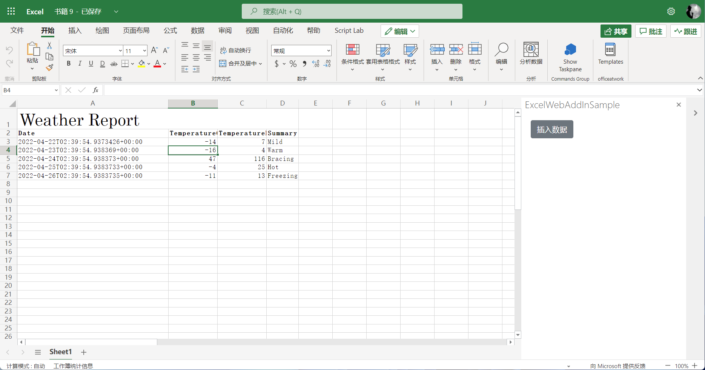

# 利用.NET 6.0 开发Microsoft 365应用 - Excel 插件
> 作者：陈希章 2022-4-20

## 概述

这个范例代码是用来展示如何利用.NET 6.0 快速开发 Microsoft 365应用，我们将展示一个Excel插件，包括了前端代码（用React编写），和后端服务（用C#编写）。用这个模板的好处是：前后端调用非常方便，不需要考虑跨域等问题。

## 如何使用

1. 下载清单文件 <https://addindemo111.azurewebsites.net/manifest.xml> 
1. 按照 <https://docs.microsoft.com/en-us/office/dev/add-ins/testing/sideload-office-add-ins-for-testing> 的说明在Excel Online中进行测试
1. 点击 "插入数据" 按钮，你可以看到下面的效果
    

## 如何实现

1. 通过 `dotnet new react -o exceladd-addin` 来创建项目
1. 通过 `dotnet run` 可以在本地运行项目
1. 为客户端项目添加 `typescript` 的支持，运行 `npm install --save-dev typescript @types/node @types/react @types/react-dom @types/jest`
1. 为项目添加Office.js 支持，运行 `npm install --svae-dev @types/office-js`
1. 为简化起见，删除 ClientApp\src\Components 目录的文件。修改 index.js 文件为 index.tsx，代码简化如下

    ```tsx
    import 'bootstrap/dist/css/bootstrap.css';
    import React from 'react';
    import ReactDOM from 'react-dom';
    import App from './App';

    const rootElement = document.getElementById('root');

    Office.onReady().then(info => ReactDOM.render(<App />, rootElement));

    ```
1. 修改App.js 文件为 index.tsx, 代码简化如下

    ```tsx
    import React from 'react';
    import { Button } from 'reactstrap';

    const App = () => {
    return (<div>
        <Button style={{ margin: 20 }} onClick={async () => {
        await Excel.run(async (context) => {
            await populateWeatherData().then(data => writeSheetData(context.workbook.worksheets.getActiveWorksheet(), data));
        })
        }}>插入数据</Button>
    </div>)

    }

    async function populateWeatherData() {
    const response = await fetch('weatherforecast');
    const data = await response.json();

    return Array.from(data, (item: any) => {
        return [item.date, item.temperatureC, item.temperatureF, item.summary]
    });
    }

    async function writeSheetData(sheet: Excel.Worksheet, data: any[]) {

    const titleCell = sheet.getCell(0, 0);
    titleCell.values = [["Weather Report"]];
    titleCell.format.font.name = "Century";
    titleCell.format.font.size = 26;
    const headerNames = ["Date", "TemperatureC", "TemperatureF", "Summary"];

    const headerRow = titleCell.getOffsetRange(1, 0).getResizedRange(0, headerNames.length - 1);
    headerRow.values = [headerNames];
    headerRow.getRow(0).format.font.bold = true;

    const dataRange = headerRow.getOffsetRange(1, 0).getResizedRange(data.length - 1, 0);
    dataRange.values = data;

    titleCell.getResizedRange(0, headerNames.length - 1).merge();
    dataRange.format.autofitColumns();

    await sheet.context.sync();
    }

    export default App;
    ```
1. 使用 `npx tsc --init` 命令生成 tsconfig.json 文件
1. 使用 `npm run build` 命令，解决所有出现的问题

## 更多参考

更多关于Excel 插件的开发，可以参考 

1. 官方文档 https://docs.microsoft.com/en-us/office/dev/add-ins/quickstarts/excel-quickstart-jquery
1. 在ASP.NET Core中集成React https://docs.microsoft.com/en-us/aspnet/core/client-side/spa/react  
1. 《Office 开发入门指南》——北京大学出版社（2019年）https://item.jd.com/12445328.html 
1. 《Office 365 开发入门指南教程》 视频课 https://study.163.com/course/courseMain.htm?courseId=1209042823&share=2&shareId=400000000620030